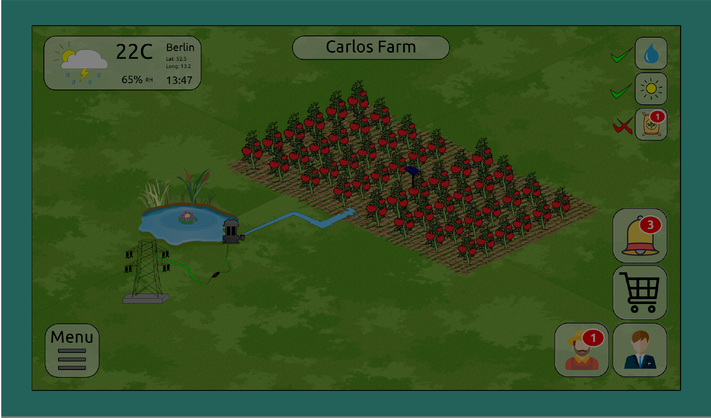

# Agrimodule - Website & Web App
> demo website and demo agrimodule webapp for IoT digital farming.




## Installation

##### With Docker: 


1. Clone repository and go inside the repository folder "site-app-docker"

```sh
git clone https://github.com/Fantaso/site-app-docker
```

2. Build the docker images

```sh
docker-compose build
```
2. Initialize database used in the web app

```sh
docker-compose run --rm app python manage.py db init
```
3. Create the database mapping ro migrate the database

```sh
docker-compose run --rm app python manage.py db migrate
```
4. Apply the migration changes detected to the database

```sh
docker-compose run --rm app python manage.py db upgrade
```
5. Add a test user to login into web app

```sh
docker-compose run --rm app python manage.py addusers
```
6. Add the crops data to the database

```sh
docker-compose run --rm app python manage.py addcrops
```
7. Run the Docker containers

```sh
docker-compose up
```


## Usage

Once docker-compose is done downloading all images and none of the services failed after you have run the containers with `docker-compose up`

#### 1. Access Website
The web application should be running and you can access it in your web browser at _http://0.0.0.0:5000_, which will take you to the website and there in the navigation bar you can find the **login** link.

#### 2. Access App
You will be prompt to enter **username** and **password**, which we have registered in *Step # 5* of the installation. Or you could register a new user following the link at the login page.

Login information:
- username = fan@fantaso.de
- password = **123456**
