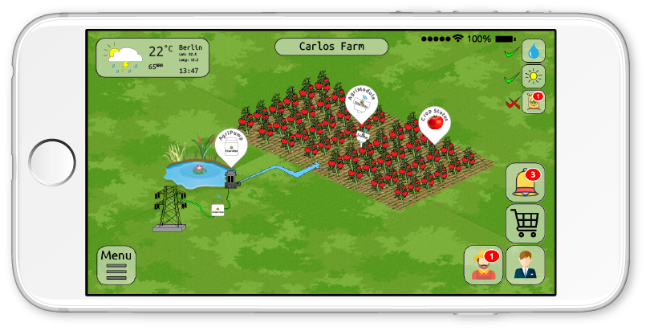

# Agrimodule - Website & Web App
> demo website and demo agrimodule webapp for IoT digital farming.



## Installation:

##### With :


1. Clone repository and go inside the repository folder "site-app-docker"
```sh
git clone https://github.com/Fantaso/site-app-docker
```

2. Build the docker images
```sh
docker-compose build
```

3. Initialize database used in the web app
```sh
docker-compose run --rm app python manage.py db init
```

4. Create the database mapping to migrate the database
```sh
docker-compose run --rm app python manage.py db migrate
```

5. Apply the migration changes detected to the database
```sh
docker-compose run --rm app python manage.py db upgrade
```

6. Add a test user to login into web app
```sh
docker-compose run --rm app python manage.py addusers
```

7. Add the crops data to the database
```sh
docker-compose run --rm app python manage.py addcrops
```

8. Add the crops data to the database
```sh
docker-compose run --rm app python manage.py addlicenses
```

9. Run the Docker containers
```sh
docker-compose up
```


## Usage:
Once docker-compose is done downloading all images and none of the services failed after you have run the containers with `docker-compose up`


#### 1. Access Website
The web application should be running and you can access it in your web browser at _http://0.0.0.0:5000_, which will take you to the website and there in the navigation bar you can find the **login** link.


#### 2. Access App - Flask
Access the web app at _http://0.0.0.0:5000/app_
You will be prompt to enter **Username** and **Password**, which we have registered in `Step # 6` of the installation. Or you could register a new user following the link at the login page.

Login information:
- Username = fan@fantaso.de
- Password = **123456**


#### 3. Access Database Client - Adminer
Access the web app at _http://0.0.0.0:8080_
You will be prompt to enter **System**, **Server**, **Username**, **Password**, **Database** which has been pre-configured within the web app at `config.py` and the `docker-compose.yml` files.

Login information:
- System = **PostgreSQL**
- Server = **db**
- Username = **postgres**
- Password = **password**
- Database = **mydb**


## Information:
| Technology Stack | |
| - |:-:|
| Python          |  |  
| Flask           |  |  
| SQLAlchemy      |  |
| PostgreSQL      |  |
| Docker          |  |
| Docker-Compose  |  |
| Adminer         |  |

[https://github.com/Fantaso/site-app-docker](https://github.com/fantaso/)
